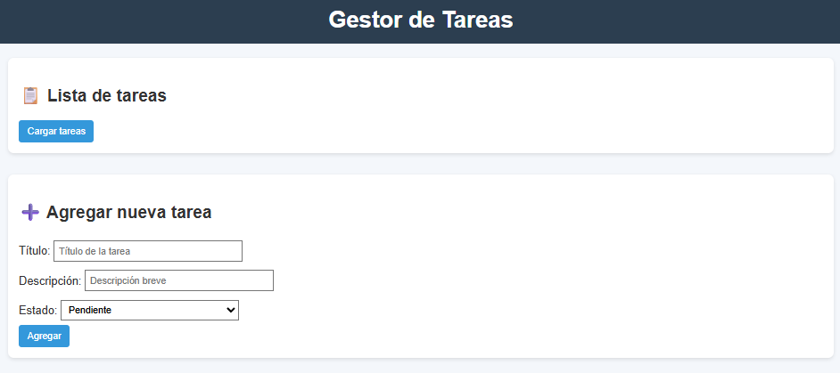
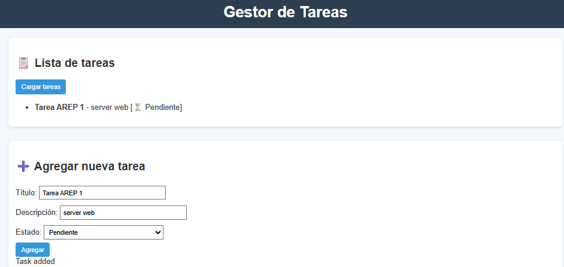
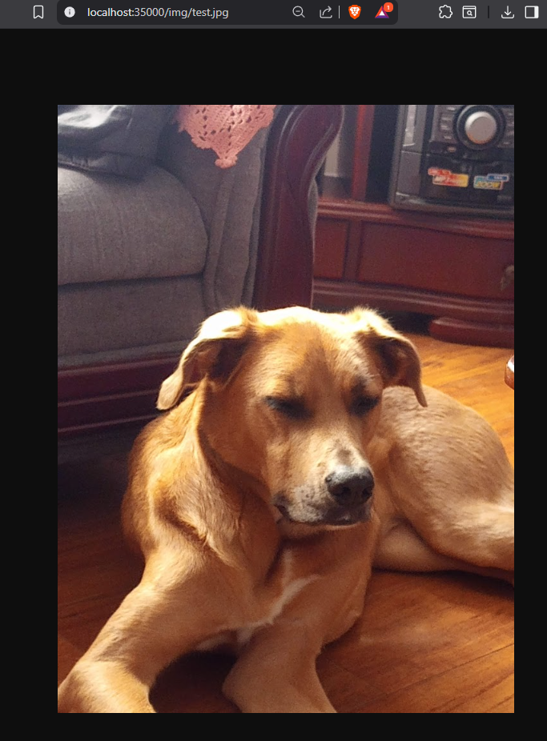

# Taller diseño y estructuración de aplicaciones distribuidas en internet

Servidor HTTP mínimo en Java, sin frameworks, capaz de servir archivos estáticos y exponer una API REST sencilla para gestión de tareas.

## Comenzando

Estas instrucciones te permitirán obtener una copia del proyecto y ejecutarlo en tu máquina local para desarrollo y pruebas.

### Prerequisitos

* Java 8 o superior
* Maven
* Browser

## Instalando

1. Clona el repositorio
   ```
    git clone https://github.com/DavidBarbosag/tallerDisenoEstructuracionAplicacionesInternet.git
   ```

2. Entra al directorio del proyecto
3. Compila el proyecto con Maven
   ```
     mvn clean package
   ```
4. Ejecuta el servidor
  ```
    java -cp target/http-mini-server-1.0-SNAPSHOT.jar http.SimpleHttpServer
  ```
5. Accede mediante este url http://localhost:35000.


## Uso

* Para ver la página principal:
http://localhost:35000/



* Al agregar una tarea, se muestran en la lista de tareas.



* Para consultar las tareas (API):
http://localhost:35000/api/tasks

* Para mostrar los archivos estáticos:
http://localhost:35000/<ruta_del_archivo>
    (Muestra el contenido del archivo si existe).




## Authors
David Alfonso Barbosa Gómez

   
